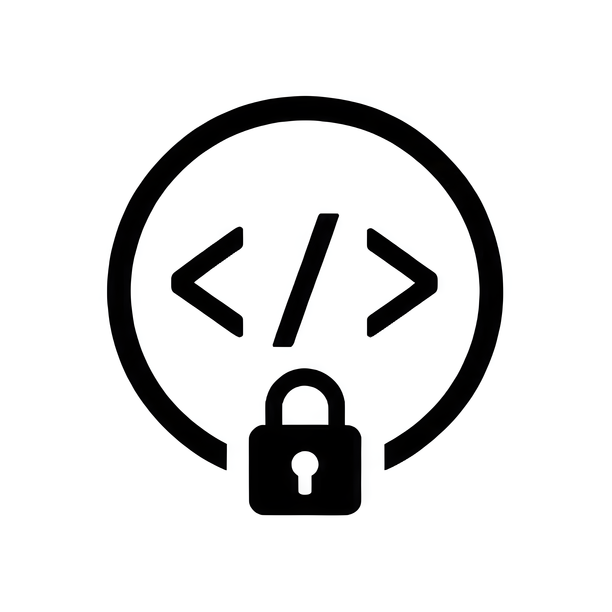
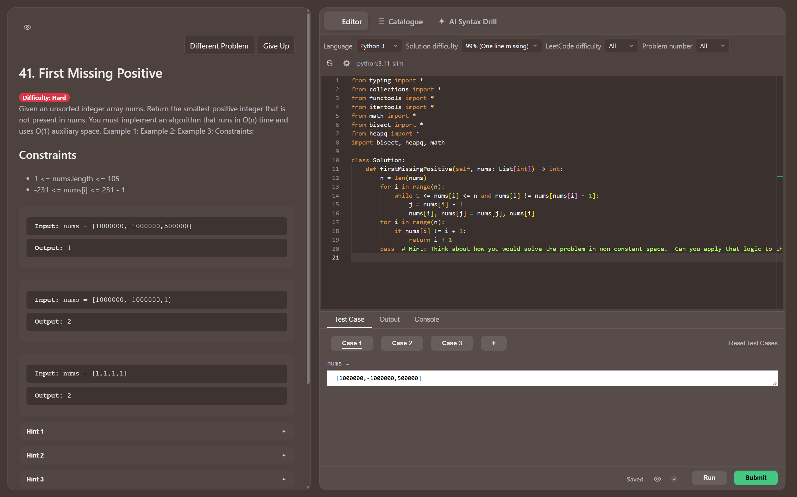
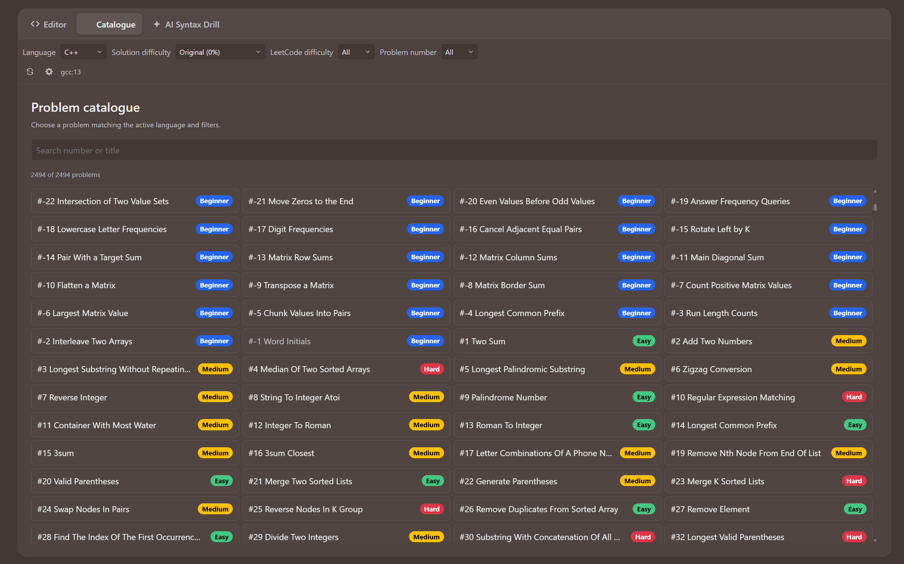
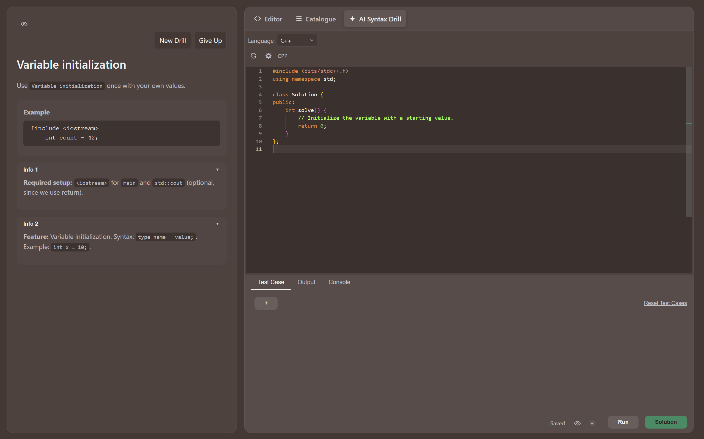

<div align="center">



# CodeGate

Solve a LeetCode-style coding challenge before returning to Windows.

[Download the latest release](https://github.com/dannys0n/CodeGate/releases/latest)

</div>

CodeGate turns Windows sign-in, unlock, and wake into a locally judged LeetCode-style challenge.
Solve it to continue, or use the optional problem catalogue and AI Syntax Drills for extra practice.



> [!IMPORTANT]
> CodeGate is a self-discipline tool, not a Windows security boundary. It does not replace parental
> controls, account security, or operating-system access policies.

## Highlights

- **LeetCode-style challenges:** Work from familiar problem statements, examples, constraints,
  starter code, and test cases in a Monaco-based editor.
- **Entirely local judging:** Supported languages compile and run in isolated Docker containers.
  Your source code and test results stay on your computer.
- **Windows event launch:** Open CodeGate automatically after sign-in, unlock, or resume from
  sleep, with each event independently configurable.
- **Adjustable solution difficulty:** Start from the original starter, a partially stripped
  reference solution, a one-line-missing challenge, or the full solution.
- **Searchable problem catalogue:** Browse and filter thousands of adapted challenges by language,
  number, and difficulty, with solved status tracked per language. Short beginner problems are
  available exclusively through the catalogue.
- **Local AI assistance:** Optionally stream algorithm hints, explain highlighted code, and
  generate short AI Syntax Drills with Docker Model Runner.
- **Bring your own model endpoint:** Use an OpenAI-compatible local endpoint instead of the bundled
  Docker model workflow.
- **Optional IntelliSense:** Get completions and hover information from isolated language servers
  for every supported language.
- **Reliable recovery:** Give Up and startup recovery remain independent of Docker, the judge, and
  AI features.

## Quick setup

You need:

- Windows 10 or 11
- [Docker Desktop](https://www.docker.com/products/docker-desktop/) with its WSL 2 backend

Docker Desktop is a separate third-party product. It is free for personal use, education,
non-commercial open-source projects, and qualifying small businesses; other organizational use
may require a paid Docker subscription. Review the current
[Docker Desktop license terms](https://docs.docker.com/subscription/desktop-license/) for your use
case.

Then:

1. Download `CodeGate-Setup-*.exe` from the
   [latest release](https://github.com/dannys0n/CodeGate/releases/latest).
2. Start Docker Desktop.
3. Run the installer and choose when CodeGate should open. Sign-in, unlock, and resume are enabled
   by default.
4. Launch CodeGate.

The first submission in a language may take longer while Docker downloads its runner image. The
optional local AI model downloads after CodeGate launches, so it cannot block installation.

## What it does

1. Selects a compatible problem, language, starter file, reference solution, and test set.
2. Loads the selected solution difficulty into the normal editor.
3. Runs submitted code through the existing CoJudge validators and isolated Docker runners.
4. Closes the session after every required test passes.

Changing language or solution difficulty keeps the same problem. **Different Problem** is the only
normal action that replaces it.

CodeGate currently supports:

| Language | Runner |
|---|---|
| C++ | GCC 13 |
| Python | Python 3.11 |
| Java | JDK 22 |
| C# | .NET 8 |
| Rust | Rust 1.78 |
| Go | Go 1.22 |
| TypeScript | Node.js 22 |

Solution difficulty controls how much of the reference implementation is shown:

| Level | Editor content |
|---:|---|
| Original (0%) | Original starter code |
| 25%, 50%, 75% | Progressively reduced reference solution |
| 99% | One eligible implementation line replaced by a hint |
| Solution (100%) | Complete reference solution |

New sessions default to 99%. Partial solutions are learning aids and are not guaranteed to compile;
only submitted code is judged.

## Problem catalogue

Enable **Extra Problem Features** in settings to browse the lazy-loaded catalogue. Problems can be
searched and filtered by language, number, LeetCode difficulty, and solution difficulty. Solved
status is tracked separately for each language. The catalogue also contains short beginner
problems that are intentionally excluded from normal random problem selection.



The generated catalogue currently contains 2,494 adapted problem records. Unsupported
problem/language combinations are excluded rather than exposed as unreliable challenges.

## AI Syntax Drill

The optional AI helper adds short syntax exercises intended to take seconds rather than full
algorithm problems. Drills focus on everyday language and standard-library usage, provide compact
examples and reference information, and compile the result locally.



The same helper can stream an algorithm hint into the problem panel or explain highlighted code in
the Console. It can use:

- Docker Model Runner with a local model; or
- a user-provided OpenAI-compatible endpoint.

Docker Model Runner requires Docker Desktop 4.41 or newer. CodeGate prefers supported GPU
acceleration, falls back to CPU inference, and unloads its local model when the app closes.
Providing a custom endpoint disables the Docker-backed model without deleting it.

## IntelliSense

IntelliSense is optional. Each supported language uses an isolated Docker language-server image.
Only the server for the active language runs, and it stops when the language changes or CodeGate
closes. Disabling IntelliSense keeps downloaded images so it can be enabled again without a
rebuild.

## Local behavior and recovery

- Judging runs locally through Docker.
- The bundled AI path runs locally; data is sent elsewhere only when you configure an external AI
  endpoint.
- The published application does not include CodeGate analytics or telemetry.
- **Give Up** does not depend on the judge, Docker, or AI.
- If the app cannot start safely, its recovery screen provides diagnostics and an immediate exit.

See the [privacy statement](PRIVACY.md) for local storage, downloads, optional endpoints, and the
legacy development-only Firebase configuration. Please report vulnerabilities through the
[security policy](SECURITY.md).

## Development setup

Development additionally requires [Git](https://git-scm.com/) and
[Node.js](https://nodejs.org/) 18 or newer.

```powershell
git clone https://github.com/dannys0n/CodeGate.git
cd CodeGate
.\setup.bat
```

`setup.bat` installs npm dependencies, checks out the required upstream datasets at pinned commits,
and generates the compact local catalogue. Raw source repositories and generated development
artifacts are ignored by Git.

Run the desktop app for development:

```powershell
.\quick-test.bat
```

Build a local Windows installer:

```powershell
.\build-release.bat
```

Artifacts are written to:

```text
dist-desktop\CodeGate-Setup-<version>.exe
dist-desktop\win-unpacked\CodeGate.exe
```

Run the main checks:

```powershell
npm.cmd test -- --run
npm.cmd run check
npm.cmd run build
```

Additional contributor documentation:

- [CodeGate architecture and operations](docs/CODEGATE.md)
- [Adding problem sources](docs/ADD_PROBLEMS.md)
- [Adding a language runner](docs/ADD_LANGUAGE.md)

## License and attribution

CodeGate-specific code is available under the [MIT License](LICENSE). The application is derived
from the MIT-licensed [CoJudge](https://github.com/cojudge/cojudge) project and retains its editor,
problem-pack model, validators, submission flow, and Docker runners.

The catalogue adapter uses material from several upstream projects:

| Source | Role | Declared license/status |
|---|---|---|
| [CoJudge](https://github.com/cojudge/cojudge) | Judge and existing problem packs | MIT |
| [Kamyu104 LeetCode Solutions](https://github.com/kamyu104/LeetCode-Solutions) | Reference solutions | MIT |
| [Doocs LeetCode](https://github.com/doocs/leetcode) | Reference solutions | CC BY-SA 4.0 |
| [Newfacade LeetCodeDataset](https://huggingface.co/datasets/newfacade/LeetCodeDataset) | Structured tests | Apache 2.0 |
| [NVIDIA LiveCodeBench-CPP](https://huggingface.co/datasets/nvidia/LiveCodeBench-CPP) | Optional importer source | CC BY 4.0 |
| [Neenza LeetCode Problems](https://github.com/neenza/leetcode-problems) | Statements and starters | No explicit license at the pinned revision |

Imported statements, tests, and solutions remain subject to their upstream terms. CodeGate is not
affiliated with or endorsed by CoJudge, LeetCode, NVIDIA, or any listed dataset maintainer.
