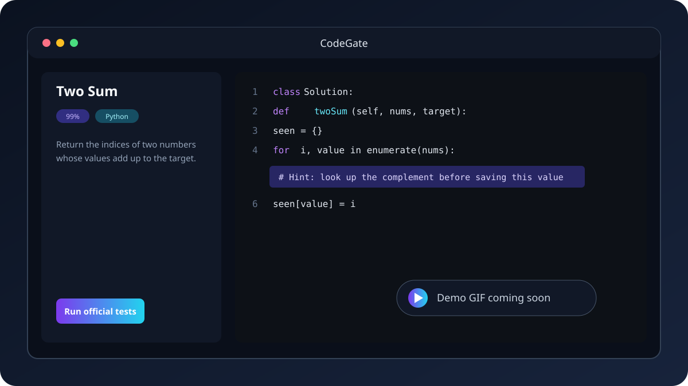

<div align="center">

# CodeGate

### Earn your screen time by solving a coding challenge.

CodeGate is derived from the open-source [CoJudge](https://github.com/cojudge/cojudge) offline
judge and adapts it into a fullscreen Windows self-discipline app. Finish the selected problem,
pass its official tests, and continue with your day.



_Demo GIF coming soon._

</div>

> [!IMPORTANT]
> CodeGate is a motivational tool, not a Windows security boundary. It does not replace account
> security, parental controls, or operating-system access policies. **Give Up** and recovery remain
> available even when Docker or the judge is unavailable.

## What it does

- Opens a coding challenge at Windows sign-in, unlock, or resume from sleep.
- Uses the familiar Monaco editor with dark mode enabled by default.
- Supports Java, Python, C++, C#, Rust, Go, and TypeScript through Docker runners.
- Keeps the same problem while you switch language or difficulty.
- Unlocks only after an explicit submission passes every official test for the active challenge.
- Runs locally and reuses CoJudge's problem packs, submission API, runners, and validators.

## How it works

1. CodeGate selects a compatible problem, language, starter, reference solution, and test set from
   its local catalog.
2. It derives the chosen difficulty in memory and opens the result as an ordinary source file.
3. Your submission runs through the existing CoJudge judge and Docker runner.
4. A passing result closes the gate. You can also use **Give Up** at any time.


Changing difficulty never changes the active problem. The current difficulty levels are:

| Level | Editor content |
|---:|---|
| Original (0%) | The original starter supplied with the problem |
| 25%, 50%, 75% | Deterministic reductions of the reference solution |
| 99% | The reference solution with exactly one eligible implementation line replaced by a hint |
| Solution (100%) | The complete reference solution |

New sessions start at **99%**. Partial levels are learning aids and are not guaranteed to compile;
only code explicitly submitted by the user is judged.

## Getting started

CodeGate is currently built from source. You will need:

- Windows 10 or 11
- [Git](https://git-scm.com/)
- [Node.js](https://nodejs.org/) 18 or newer and npm
- [Docker Desktop](https://www.docker.com/products/docker-desktop/) using its WSL 2 backend

Clone the repository, then run the setup script from PowerShell or by double-clicking it:

```powershell
git clone https://github.com/dannys0n/CodeGate.git
cd CodeGate
.\setup.bat
```

Setup installs npm dependencies, restores the required upstream data sources at pinned commits,
and generates the local problem catalog. Raw source repositories and the generated catalog are
ignored by Git. The optional multi-gigabyte LiveCodeBench dataset is skipped by default; importer
developers can include it with:

```powershell
.\setup.bat -IncludeOptionalSources
```

Docker Desktop may download a language image the first time that language is judged. Keep Docker
running and allow a little extra time for the first submission.

### Quick desktop test

Run:

```powershell
.\quick-test.bat
```

This regenerates the catalog, builds the web application, selects an available local port, and
opens the Electron desktop wrapper. Its build output stays in the repository's ignored build
directories.

### Web development

```powershell
npm.cmd run dev -- --host 127.0.0.1
```

Open `/gate` for CodeGate mode. Standard CoJudge problem routes and game mode remain available
outside it.

## Build the Windows installer

Run the release script:

```powershell
.\build-release.bat
```

It creates both the installer at `dist-desktop\CodeGate-Setup-0.1.0.exe` and the unpacked app at
`dist-desktop\win-unpacked\CodeGate.exe`. It does not install or launch either artifact. Run the
installer manually when you want to test its wizard and startup options.


The installer lets the user choose sign-in, unlock, and resume-from-sleep startup events; all three
are selected by default. Uninstalling CodeGate removes its scheduled startup registration,
application files, and per-user state. Removing shared Docker images is an optional uninstall step
because those images may be used by other projects.

## Project scripts

| Script | Purpose |
|---|---|
| `setup.bat` | Prepare a fresh checkout for development |
| `quick-test.bat` | Build and launch a disposable local desktop test |
| `build-release.bat` | Produce the Windows installer and unpacked release app |

Run `setup.bat` once after cloning, `quick-test.bat` while developing, and `build-release.bat` when
you need distributable artifacts. Setup's implementation lives under `scripts/` to keep the
repository root focused on these three entry points.

## Problem catalog

The offline adapter joins several existing datasets without copying every variant into a new
problem-pack format:

- [Neenza LeetCode Problems](https://github.com/neenza/leetcode-problems) for statements and
  starter signatures
- [Kamyu104 LeetCode Solutions](https://github.com/kamyu104/LeetCode-Solutions) and
  [Doocs LeetCode](https://github.com/doocs/leetcode) for reference solutions
- Existing CoJudge packs and [Newfacade LeetCodeDataset](https://huggingface.co/datasets/newfacade/LeetCodeDataset)
  for tests and validators
- [NVIDIA LiveCodeBench-CPP](https://huggingface.co/datasets/nvidia/LiveCodeBench-CPP) as an
  optional importer-development source

The compact JSON catalog stores one record per problem with its supported languages nested beneath
it. Only the selected challenge is loaded and exposed as a temporary ordinary CoJudge pack. A
catalog entry describes a match between source assets; it is not a promise that every upstream
reference solution has already passed the selected tests.

Unsupported or unsafe combinations are quarantined instead of appearing in the picker. Current
deferred categories include interactive, SQL, shell, concurrency, external-API, linked-list, tree,
and class-operation problems that cannot yet be adapted reliably.

## Validation

Before opening a pull request, run the checks relevant to your change:

```powershell
npm.cmd test -- --run
npm.cmd run check
npm.cmd run build
npm.cmd run importer:test
npm.cmd run desktop:test
```

Catalog and recovery checks are also available:

```powershell
npm.cmd run codegate:candidates
npm.cmd run codegate:failure-smoke
```

## Documentation

- [Operations, architecture, startup, recovery, and uninstall](docs/CODEGATE.md)
- [Adding a problem pack](docs/ADD_PROBLEMS.md)
- [Adding a language runner](docs/ADD_LANGUAGE.md)

## Status

CodeGate is an early-stage Windows project. The core desktop flow, catalog generation, difficulty
selection, Docker judging, Give Up path, startup registration, and installer are implemented. The
visuals above are placeholders for public screenshots and recordings.

## License and attribution

CodeGate-specific contributions are available under the [MIT License](LICENSE). CodeGate is
derived from the MIT-licensed [CoJudge](https://github.com/cojudge/cojudge) codebase; it is not
represented as an official GitHub fork because this repository has an independent Git history.
CoJudge supplies the foundation for the web application, editor, problem-pack format, submission
API, validators, and Docker runners.

Problem statements, tests, reference solutions, and other imported material remain under their
respective upstream terms:

| Source | Declared license or status |
|---|---|
| CoJudge | MIT |
| Kamyu104 LeetCode Solutions | MIT |
| Doocs LeetCode | CC BY-SA 4.0 |
| Newfacade LeetCodeDataset | Apache 2.0 |
| NVIDIA LiveCodeBench-CPP | CC BY 4.0 |
| Neenza LeetCode Problems | No explicit license at the pinned revision |

CodeGate is an independent project and is not affiliated with or endorsed by CoJudge, LeetCode,
NVIDIA, or any referenced dataset maintainer. Attribution does not itself grant redistribution
rights. In particular, Neenza's repository contains LeetCode-derived material but does not provide
an explicit license, so it must not be bundled into a public release unless appropriate permission
or a suitably licensed replacement is obtained. Local setup downloads source repositories
separately for development.

Before distributing an installer or generated catalog, preserve all upstream notices, identify
modified material, comply with applicable attribution and share-alike requirements, and review the
terms of every included source. This project does not claim ownership of third-party problem
statements, tests, or reference solutions.
